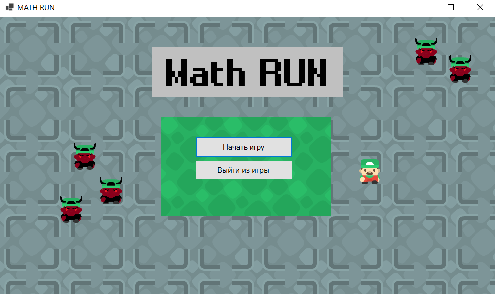
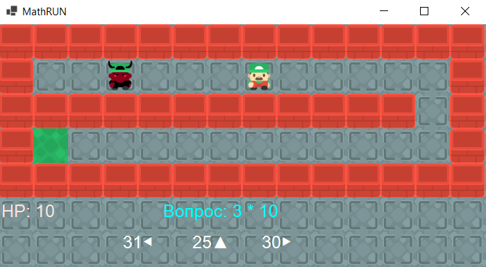

# Математическая мини-игра

## Реализация
1. Игра реализована на основе MVC
2. Стек - C# Winforms

## Описание игры
### Игра напоминает раннер, поскольку цель - убежать от монстра

### Чтобы сделать шаг, нужно верно ответить на арифметический вопрос. Неправильные ответы снимают очки HP.
Управление производится стрелочками на клавиатуре. "Влево" - левый вариант ответа, "вверх" - средний вариант ответа, "вправо" - правый вариант ответа

### После того как игрок добежал до финиша, сразу открывается следующий лабиринт
	
